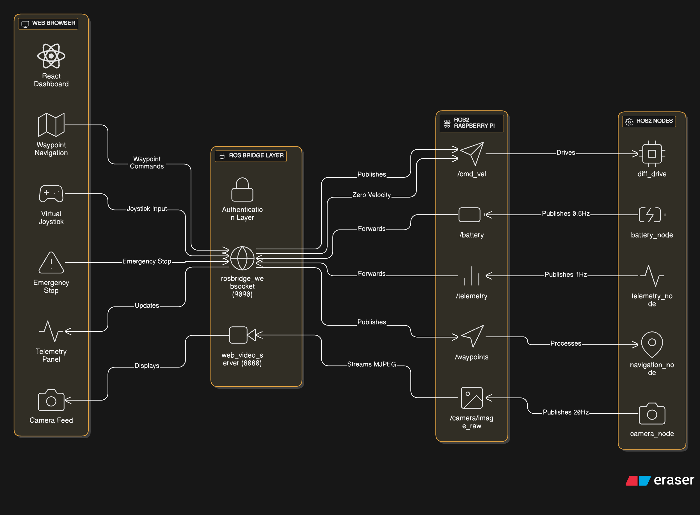

# System Architecture

This document provides a detailed overview of the system architecture for the ROS 2 Robot Dashboard. It covers the hardware components, software stack, and the communication protocols that enable real-time control and monitoring of the robot.

## System Architecture Diagram

The following diagram illustrates the high-level architecture of the system, showing the relationship between the web-based dashboard, the ROS 2 backend, and the robot's hardware.

  

## Component Breakdown

### Hardware

-   **Raspberry Pi 4:** The central processing unit of the robot, responsible for running the ROS 2 nodes and managing the hardware.
-   **IMX219 Camera Module:** Captures the video feed, which is streamed to the web dashboard.
-   **L298N Motor Driver:** Controls the DC motors, enabling the robot's movement.
-   **DC Motors:** Provide the robot's locomotion.

### Software

-   **Web Dashboard:** A React-based single-page application that provides a user-friendly interface for controlling the robot and monitoring its status.
-   **ROS 2:** The core of the robot's software, providing a structured framework for communication between the different nodes.
-   **`rosbridge_server`:** A WebSocket-based server that enables communication between the web dashboard and the ROS 2 backend.
-   **`web_video_server`:** A lightweight server that streams the camera feed to the web dashboard.
-   **`pi_robot` Package:** Contains the custom ROS 2 nodes that control the robot's hardware and publish telemetry data.
